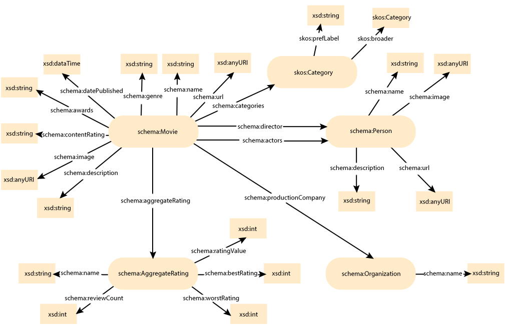

movies
======

# 1. About the project

The idea of this project is to create an application for etracting metadata about movies. The metadata is extracted from the website [Rotten Tomatoes](http://www.rottentomatoes.com), where one can find basic information about a movie, ratings, comments, recommendations etc.
Metadata is inserted in site's webpages in a structured format using [Microdata standard](http://dev.w3.org/html5/md/), specifically using [Schema.org](http://schema.org/) vocabulary. After the metadata is extracted, it is transformed to RDF format and stored into RDF repository. Access to the extracted data is enabled through RESTful services.

This application also contains algorithm for calculating similarities between movies in RDF repository. Each movie is described by certain number of categories and every category also contains list of broader categories. Categories for specfic movie are retrieved using SPARQL queries against DBPedia endpoint. Categories are described with dcterms:subject property.
Similarities between movies are calculated based on mentioned set of categories using Cosine similarity algoritm. In order to calculate Cosine similarity for two movies, first oefficients called TF-IDF (term frequency inverse document frequency) have to be defined for every category that describes a movie. TF-IDF measures the number of times word (term) appears in the document. In this case is a bit different, since one category that describes the movie can appear in list of categories for that movie only once. If the TF-IDFs are calculated for one movie for certain category (searched category in the text), following scenarios are included:
- searched category exists in the list of categories that describes the movie; in that case frequency is 1
- searched category does not exist in the list of categories that describes the movie, but exists in list of broader categories that are defined for every category in the list; in that case for every appearance in list of broader categories, frequency of searched category is increased by 0.6
- searched category does not exist in the list of categories and also does not exist in list of broader categories for every category defined in the list; in that case, broader categories of the searched category are compared with the list of categories that describes that movie; if there is match between them, frequency is equeal to 0.6; if there is no match broader categories of the searched category are compared with the list for broader categories for every category that exists in the list of categories that are describing the movie; for every match, frequency is increased by 0.4

After this, inverse document frequency should be calculated. This value is used in order to weigh down the effects of too frequently occuring category. Basically, that means that category 'English based movies' should be less important than category 'Wikipedia categories named after animated films'. This value is calculated using formula:

IDF(category) = 1 + loge(Total Number Of Movies / Number Of Movies described with this category)

After that the matrix is created. This matrix contains one row per every movie for which tf-idf coefficients are calculated and one column for every category. Values in matrix are product of TF and IDF for one category for certain movie.

Cosine similarity for two movies is calculated using the following formula:

Cosine Similarity (d1, d2) =  Dot product(d1, d2) / ||d1|| * ||d2||

Dot product (d1,d2) = d1[0] * d2[0] + d1[1] * d2[1] * … * d1[n] * d2[n]
||d1|| = square root(d1[0]2 + d1[1]2 + ... + d1[n]2)
||d2|| = square root(d2[0]2 + d2[1]2 + ... + d2[n]2) 

D1 and D2 are vectors that contain products of tf and idfs for all categories in the dataset for first two movies.

Once similarities between one movie and all other movies in the dataset are calculated they are written in the CSV file similarities.csv. This operation repeats for all the movies in the dataset.

Application workflow consists of the following phases
- A web crawler parses movie webpages from [Rotten Tomatoes](http://www.rottentomatoes.com) website and extracts movie metada
- Extracted data is transformed into RDF triplets based on [Schema.org](http://schema.org/) vocabulary
- Data is persisted into an RDF repository
- Similarities between movies are calculated and stored in .csv file
- Access to the data is enabled through RESTful services

# 2. Domain model

Webpages of movies from the [Rotten Tomatoes](http://www.rottentomatoes.com) website are analyzed in order to determine which classes and properties form the [Schema.org](http://schema.org/) vocabulary are supported. Based on that analysis, domain model is created and it is depicted in Picture 1.

Picture 1 - Domain model

Class *Movie* contains basic information about a movie, such as: movie title. description, release date, url of the movie's image, genres, and awards. Also, it has references to its actors and director (class Person), its current rating (class AggregateRating), its production company (class Organization) and its categories (class Category).

Class *Person* contains basic information ofa person, such as person's name, image, url address and short description about that person.

Class *AggregateRating* contains information about a movie rating which is calculated based on visitors' votes and comments. It hold information about the best and worst rating values, review count, current rating value and the name of the aggregate rating method.

Class *Organization* contains name of the production company.

Class *Category* contains label and list of broader categories.

# 3. The solution

This application collects metadata about movies from the webpage [Rotten Tomatoes](http://www.rottentomatoes.com). The data is extracted by the crawler and is used to create domain objects of the application that are persisted into an RDF repository. Extracted data is also used to calculate similarities between movies. These values are stored in csv file. The application allows access to that data via RESTful services.

The applications contains two REST services.

* **GET /api/ movies** - returns data about all movies. Service's parameters are:

* *limit* - number of results
* *offset* - starting position of the results
* *minReleaseYear* - minimum value of the release year 
* *maxReleaseYear* - maximum value of the release year
* *actors* - name(s) of the actors that played in the movie. Multiple actor names can be supplied, which are in that case coma separated
* *minRatingValue* - minimum rating value
* *maxRatingValue* - maximum rating value
* *productionCompany* - name of the production company
* *genres* - genres of the movie. Multiple genre names can be supplied, which are in that case coma separated
* *directedBy* - name of the movie director
* *minReviewCount* - minimum review count value
* *hasAwards* - filters out only movies that are awarder with any award. Possible values are true or false

An example of a service call:
> GET / movies?minRevireCount=10&genres=Drama,Comedy&minReleaseYear=2012&productionCompany=ParamountPictures

* **GET/movies/id** - returns data about the movie with specified id

An example of a service call:
> GET/movies/3d548b4f-07e6-4e7f-8ebc-770b8801f5a6

* **GET/movies/similar/** - returns five most similar movies from reposotory. Service's parameters are:

* *title* - movie title
* *directedBy* - movie director's name

An example of a service call:
> GET/movies/similar?title=The 39 Steps&directedBy=Alfred Hitchcock

* **GET/movies/update/repository** - updates movie repository and file with similarities. Service's parameter is:

* *url* - url from which data will be collected

An example of a service call:
> GET/movies/update/repository?url=http://www.rottentomatoes.com/top/bestofrt/top_100_action__adventure_movies/

# 4. Technical realisation

This application is written in programming language Java. 

[Jsoup library](http://jsoup.org/) is used for analyzing and collecting data from the web pages. It provides a very convenient API for extracting and manipulating data, using the best of DOM, CSS, and jquery-like methods.

this application also uses [Jenabean library](https://code.google.com/p/jenabean/) for mapping Java objects into RDF triplets using annotations. Jenabean provides explicit binding between an object property and a particular RDF property.

[Jena TDB](http://jena.apache.org/documentation/tdb/) library is used for data storage in the RDF repository. TDB is a component of Jena for RDF storage and query. It support the full range of Jena APIs.

Implementation of the RESTful web service is supported by [Jersey](https://jersey.java.net/) framework. Jersey is the open source JAX-RS Reference Implementation for building RESTful Web services. It uses annotations which define type of the HTTP requests (GET, POST ...) and also the path to the requested resource. 

# 5. Acknowledgements
This application has been developed as a part of the project assignment for the subject [Intelligent Systems](http://is.fon.rs) at the Faculty of Organization Sciences, University of Belgrade, Serbia.

# 6. Licence
This software is licensed under the [MIT License](http://opensource.org/licenses/MIT).

The MIT License (MIT)

Copyright (c) 2013 Ana Tasić - atasic90@gmail.com

Permission is hereby granted, free of charge, to any person obtaining a copy
of this software and associated documentation files (the "Software"), to deal
in the Software without restriction, including without limitation the rights
to use, copy, modify, merge, publish, distribute, sublicense, and/or sell
copies of the Software, and to permit persons to whom the Software is
furnished to do so, subject to the following conditions:

The above copyright notice and this permission notice shall be included in
all copies or substantial portions of the Software.

THE SOFTWARE IS PROVIDED "AS IS", WITHOUT WARRANTY OF ANY KIND, EXPRESS OR
IMPLIED, INCLUDING BUT NOT LIMITED TO THE WARRANTIES OF MERCHANTABILITY,
FITNESS FOR A PARTICULAR PURPOSE AND NONINFRINGEMENT. IN NO EVENT SHALL THE
AUTHORS OR COPYRIGHT HOLDERS BE LIABLE FOR ANY CLAIM, DAMAGES OR OTHER
LIABILITY, WHETHER IN AN ACTION OF CONTRACT, TORT OR OTHERWISE, ARISING FROM,
OUT OF OR IN CONNECTION WITH THE SOFTWARE OR THE USE OR OTHER DEALINGS IN
THE SOFTWARE.
